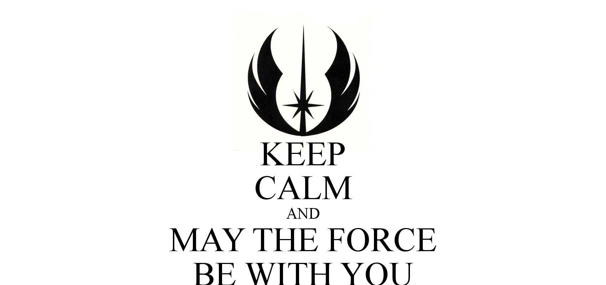

## astroconsp : Calculus2015aut

Если вы пришли сюда за pdf'кoй, то она [здесь](https://taxus-d.github.io/astroconsp/Calculus2015aut/pdf/to_final_autm2015.pdf)

This is the first created tex doc. It would remain intact for historical
reasons. If you wish to compile it, use your favourite build system.
I hope `texlive > 2012` will be sufficient for this archeological purpose.

Pdf might be obtained using the link above.

In that ancient times, there was a hope.

Partly of coincidence, it is gone.
