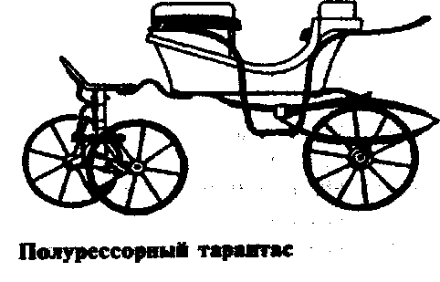

# tarantas
smoothes tex way

> зато не велосипед  © Монополь

Full-fledged reactive-powered bundle of TeX packages for writing lecture notes in Russian.
Equiped with layout-selection machinery, so you don't need to hack deeply inside document code to
reduce margins. See `tex/lyt` subdirectory for sample ones.

## Features (roadmap)

* [X] Think about possible features
* [X] Create a checklist of them

### Now, serious
#### key=value lists for options
* [X] Home-made programmable `key=val` parser.
* [X] `key=val`-style option handler
* [X] Easy package options handling.
#### flexible styling
* [X] style-selection machinery
* [ ] simple css-like style specification
* [ ] advanced css-like style specification
  * [ ] ierarchycal styling
  * [ ] `#id` selectors (?)
  * [ ] `[attribute]` selectors (??)
#### Math typing
* [X] a nicely organized set of predefined math macros
* [X] separate package for theorem and proof styles
#### ETC
* [ ] Rich toolbox
* [ ] a nice abstract syntax for counters
<!--* [ ] force all old layouts/classes to integrate inside `tarantas`.
And make them modular. At least, no more copy-pasting.
* [ ] make it work with all classes
* [ ] clean (or totally throw away) legacy files
* [ ] develop a nice abstract syntax for counters
* [ ] `ifluatex`, `ifxetex`
* [ ] enhance existing layouts aestetically
* [ ] new cool layouts-->

